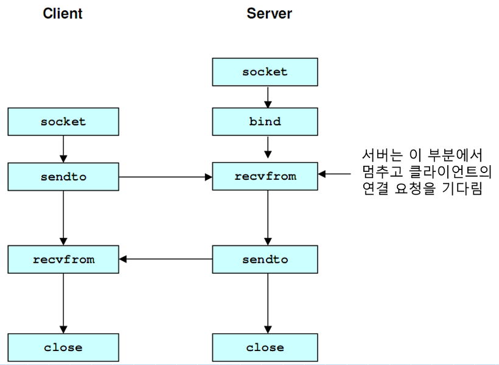

# TCP
<hr>

## TCP Summary

1. 연결형 서비스(가상 회선 방식)
2. 흐름 제어 및 혼잡 제어.
3. 높은 신뢰성 보장.
4. 전이중(FUll-Duplex), 점대점 방식(Point to Point)
5. 3-way, 4-way handshaking 과정을 사용하기 때문에 UDP보다 속도가 느림.
6. 슬라이딩 윈도우 프로토콜 사용

<hr>

## TCP server Characteristic

1. 서버소켓은 연결만을 담당.
2. 연결과정에서 반환된 클라이언트 소켓은 데이터 송수신에 사용. 
3. 서버와 클라이언트는 1:1로 연결
4. 스트림 전송으로 전송 데이터의 크기가 무제한.
5. 패킷에 대한 응답을 해야하기 때문에(시간지연, CPU 소모) 성능이 낮다.
6. 손실된 경우 재전송을 요청한다.

<hr>

## Connect
- **3-way handshaking**

1. 상대 소켓과의 연결
    ```
    SYN + ACK
    처음 동기화를 위해 SYN을 날린다.(이때, ACK는 비어있다.)

    데이터의 손실을 방지하기 위함.
    ```

2. 상대 소켓과의 데이터 송수신
    ```
    SEQ + ACK
    
    SEQ는 패킷번호.
    ACK는 SEQ + 전송된 바이트 크기 + 1.

    데이터의 일부가 손실되었는가를 방지하기 위함.

    데이터의 일부가 손실되었을 경우, 특정 시간이 지나면 패킷을 재전송한다.
    ```

- **4-way handshaking**
3. 상대 소켓과의 연결종료
    ```
    FIN (종료를 알리는 메시지)
    ```

<hr><hr>

# UDP

<hr>

## UDP Summary

1. 비연결형 서비스(데이터 그램 방식)
2. 정보를 주고 받을 때 정보를 보내거나 받는다는 신호절차를 거치지 않음.
3. UDP header의 CheckSum 필드를 통해 최소한의 오류만 검출
4. 신뢰성이 낮다.
5. TCP보다 속도가 빠르다.

<hr>

## UDP server Characteristic

1. UDP에는 연결 자체가 없어서(connect()불필요) 서버 소켓과 클라이언트 소켓의 구분이 없다.
2. 소켓 대신 IP를 기반으로 데이터를 전송
3. 서버와 클라이언트는 1:1, 1:N, N:M으로 연결 가능
4. 데이터그램(메시지)단위로 전송되며 그 키는 65535 Byte로, 크기가 초과하면 잘라서 보낸다.
5.  흐름제어(송수신의 데이터의 처리 속도를 조절하여 수신자의 버퍼 오버플로우를 방지하는 것)가 없어서 패킷이 제대로 전송되었는지, 오류는 없는지 확인할 수 없다.
6. 파일 전송과 같은 신뢰성이 필요한 서비스보다 성능이 중요시 되는 경우에 사용

<hr>

<hr><hr><hr>

# Programming
<hr>

## TCP flow


<hr>

## UDP flow



<hr>

## Require header files only Linux
    ```
    #include <stdio.h>
    #include <stdlib.h>
    #include <string.h>
    #include <unistd.h>
    #include <arpa/inet.h>
    #include <sys/socket.h>
    ```
<hr>